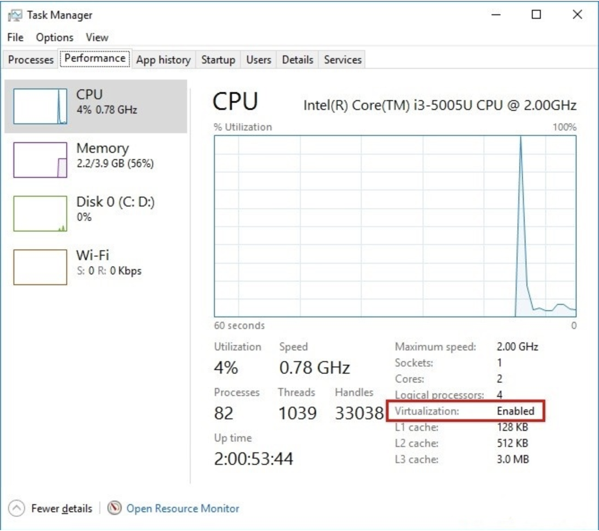
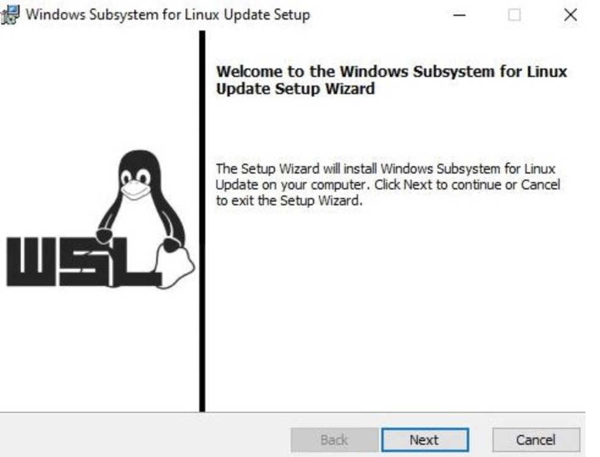
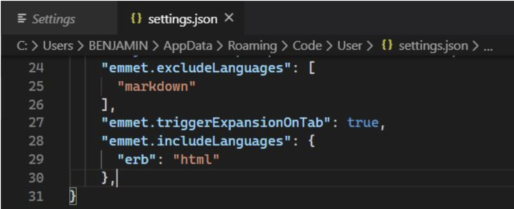
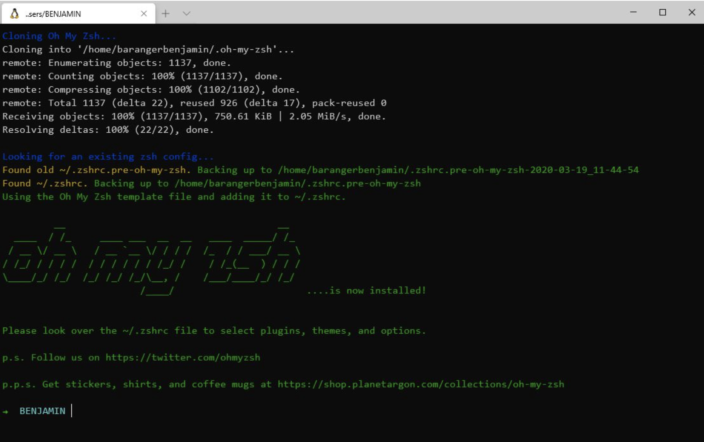
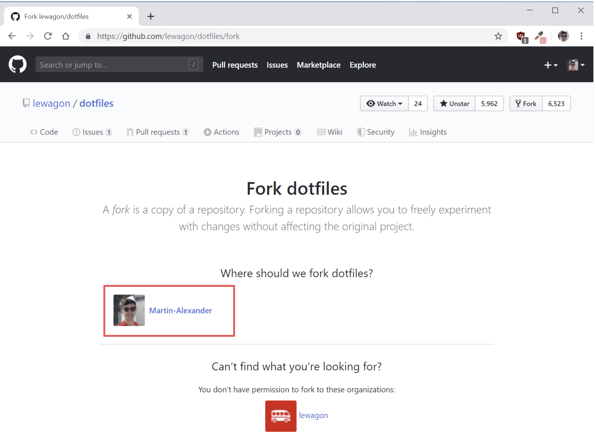

# Setup your machine!


Welcome to this setup where we are going to install the tools required to make your machine a true developer environment 💪. The following instructions will help you to get ready for The Ubisoft Legal Dev fullstack bootcamp:

- Install a code editor, where you will spend your days and nights
- Install a package manager
- Pimp your Terminal
- Setup git and GitHub
- Install Ruby


## Prerequisites


Before we start, it is important you meet the following prerequisites to ensure the smooth running of the setup. Take your time to read through everything and do not hesitate to ask for help if you feel stuck. Ready? Let's go 😎

##### Latest version of Windows
For this setup, you need to be using the latest version of Windows.

This means that you need to be on Windows 10, with all the latest updates installed.

You can check your software version by clicking on **Start>Settings>System>About**. Look where it says **Edition**. If you see something that starts with "Windows 10..." you're good to go 💪.

Not the case? Don't panic 😱 You can always install Windows 10 from [Microsoft](https://www.microsoft.com/en-gb/windows/get-windows-10) (it should take roughly an hour to install but this is dependent on your computer). Click on **Check for Updates**, then follow the instructions on the screen. Come back to this setup when Windows 10 is installed.

Once you're sure that you're using Windows 10, you will need to check that your computer has all the latest updates. For this click on **Start>Settings>Updates & Security>Windows Update**, then click on **Check updates**. If you have updates available please install them and repeat the process until it says that you are up to date ⭐.

#### The Insider program

For the best development tools we need to be part of the **Windows Insider** program which gives access to pre-release versions of various tools.

Go to **Start → Settings → Updates & Security → Insider Program**

Click on **Get Started**. It will ask you to **Link an account**; follow the instructions on screen. You will be asked to choose your Insider parameters, choose the second setting, the **fast** one ⚡. Then confirm and restart your computer when you are asked to do so.

After your computer has restarted you can double-check that you are now part of the Insider program by clicking on **Start → Settings → Updates & Security → Insider Program.** You should then be prompted with the Insider parameter that you chose earlier, i.e. fast.

By joining the Insider program you have unlocked more content and updates — which we also need to install. Go to **Start → Settings → Updates & Security → Windows Update,** you should see new updates available. ⚠️ These updates can take a rather long time of more than 30 minutes, so make sure your computer has enough battery left, and that you won't have to close it during the installation ⚠️

Start the update and go grab a coffee ☕ or tea 🍵.

After your computer has restarted, go to **Start → Settings → System → About**. This time check the **Version**, if it says at least 2004, you are good to go 😎.

#### Virtualization

We need to ensure that the Virtualization options are enabled in the BIOS of your computer.

For many computers, this is already the case. Let's check:

- Press Ctrl + Alt + Del.
- Select Task Manager.
- Click on the Performance tab.
- Click on CPU.
- The status will be listed under the graph and will say "Virtualization: Enabled" if this tool is enabled.




## GitHub account


Have you signed up to GitHub? If not, [do it right away](https://github.com/).

👉 [Upload a picture](https://github.com/settings/profile) and put your name correctly on your GitHub account. This is important as we'll use an internal dashboard with your avatars. Please do this now, before you continue with this guide.

## Windows Subsystem for Linux


WSL is the development environment we are using to run Ubuntu. You can learn more about WSL [here](https://docs.microsoft.com/en-us/windows/wsl/faq).

Click on **Start** and type **powershell**. Right click on **Windows Powershell**, then on **Run as administrator**. A blue terminal window will appear. Copy the following commands, paste them into the terminal windows by right-clicking into it, and run them by pressing Enter:

(If you are asked to restart your computer, type **n** and **enter** to prevent your computer from restarting at that moment).

```
Enable-WindowsOptionalFeature -Online -FeatureName Microsoft-Windows-Subsystem-Linux
```

```
dism.exe /online /enable-feature /featurename:Microsoft-Windows-Subsystem-Linux /all /norestart
```

````
dism.exe /online /enable-feature /featurename:VirtualMachinePlatform /all /norestart
````

**When all three commands ran without any errors, restart your computer**.

Once your computer has restarted, click on **Start** and type **Microsoft Store**. Launch it. In the search bar, type **Ubuntu**. Click on the result that says **Ubuntu plainly**, not **Ubuntu 18.04 LTS**. Then, click on **Install**.

⚠️ There is no progress bar for this installation. When it is done you will be asked, in the bottom right corner, to launch it.

The first time you open WSL - you will be asked to choose a username ⚠️. Your username should **be one word, lowercase** with **no special characters** ⚠️, for example: `legaldevbootcamp.`

It will then ask you for a new password. When you type your password, ⚠️ it will not appear on the screen ⚠️ – and there will be no familiar typing indicator even though your keystrokes are being registered. This is a security feature to mask not only your password as a whole but also its length!

You will have to retype your password, and then the installation should be complete.

You can close the terminal now that WSL is installed on your computer.


#### Upgrade to WSL 2


First, we need to download the [WSL2 installer](https://docs.microsoft.com/fr-fr/windows/wsl/wsl2-kernel). Click on the suggested link to download the update package and once it is downloaded, open the program.




Click on **Next**, then **Finish**.

We also need to make sure that the program files are not compressed. Let's enable an option to let you see hidden files/folders 🕵️‍♀️. Click on **Start**. In the search bar type **folder**, open the folder options. Click on the second tab **View**, then under **Hidden files and folders**, select **Show hidden files, folders, and drives**. Click on **Apply**, then **Ok** to close this window.

Open a file explorer. In the sidebar click on **This computer → Windows (C:) → Users → your username account → AppData → Local → Packages.** Here you need to locate the folder starting with **CanonicalGroupLimited.UbuntuonWindows** and open it.

Locate the **LocalState** folder and **right click** on it, then click on **Properties → Advanced**.

Make sure that the option **Compress content** is **not** ticked. Click on **Ok** to validate your choice. You will be asked if you want to apply this change only to this folder, or also the subfolders. Please choose only this folder.

Click on **Start**. In the search bar type **cmd**, open the **Command Prompt**. You will see all the WSL updates installed on your machine with the command:


```
wsl -l -v
```

(translates to "wsl list version")
You should see the Ubuntu version that you installed before.
Let's upgrade it to the version 2, by running the following command:

```
wsl --set-version Ubuntu 2
```

A message will appear telling you that the conversion is in progress and that it will take a few minutes.
When you get the message **The conversion is complete**, paste the first command into the command prompt again:


```
wsl -l -v
```

and double-check that the version is now **2**.


## Windows Terminal


As with Ubuntu, click on **Start**, type **Microsoft Store**, and launch it.

In the search bar, type **terminal**, then in the list of results, click on **Windows Terminal (Preview)**.

Install it, and afterwards **reboot** your computer.

After the restart, click on **Start** and type **terminal**. Open **Windows Terminal (Preview)**.

This terminal allows you to open multiple terminal tools, including **Powershell, Command Prompt**, and **Ubuntu** that you installed earlier 👆 This terminal has tabs. Locate the **down arrow** / v-shape next to the open tab, and click on it. It will show you all the terminals you can open from here, **but for the rest of this guide, we will only need Ubuntu**.

Voilà, you are in **your Ubuntu Terminal** 🎊 From now on, every time we will refer to the terminal/console it will be this one.


## Git


To install ``git``, first open an Ubuntu terminal. To open an Ubuntu terminal, hit **Start**, type **windows terminal**, and click on **Windows Terminal (Preview)**, then open an Ubuntu tab via the drop-down menu next to the already open Windows Powershell tab.

Then copy and paste the following lines **one line at a time** (note that you can paste by doing a right click in the terminal):


```
sudo apt update
```

```
sudo apt install -y git apt-transport-https unzip gnome-terminal
```

## Visual Studio Code


We use Visual Code Studio for writing code on Windows, because it integrates nicely with the Ubuntu terminal.

For this integration to work, you need to uninstall other code editor, like for example SublimeText, as their WSL integration interferes with the integration of VS Code.

Go the [Visual Studio Code](https://code.visualstudio.com/download) page and click on Windows. The tool should start to download automatically. Open the file you have just downloaded. Install it leaving all the default options as they are.

To help VS Code interact with your terminal, we need to add the extension **Remote Development**. Go to the [extension page](https://marketplace.visualstudio.com/items?itemName=ms-vscode-remote.vscode-remote-extensionpack) and click on **Install**. This will tell you that VS Code is required to install this extension. Click on **Continue**. You will get an alert asking you to open Visual Studio Code. The editor will open to the extension page.


Click on **Install**. Click on **File → Preferences → Keymaps**. Click on **Sublime Text Keymap** and **Settings Importer**. Click on **Install**. Click on **Reload Required**.

Let's gain time now and add the Ruby on Rails support for your code editor. Go to the [extension page](https://marketplace.visualstudio.com/items?itemName=hridoy.rails-snippets) and follow the same steps as the Remote Development one.

Press ``Ctrl`` + ``,`` on your keyboard to open the settings. In the search bar, type **emmet**. Click on **Edit in settings.json** Paste the following just before the last ``}``


```
"emmet.triggerExpansionOnTab": true,
"emmet.includeLanguages": {
  "erb": "html"
},
```

It should look like this:



Now, your code editor is ready 💪.


## Oh-my-zsh - Fancy your Terminal


We will use the shell named ``zsh`` instead of ``bash``, the default one.

```
# it will ask for your session password
sudo apt install -y zsh curl vim nodejs imagemagick jq
```

```
sh -c "$(curl -fsSL https://raw.githubusercontent.com/robbyrussell/oh-my-zsh/master/tools/install.sh)"
```

At then end, your terminal should look like this:




## GitHub


We need to generate SSH keys which are going to be used by GitHub and Heroku to authenticate you. Think of it as a way to log in, but different from the well known username/password couple. If you already generated keys that you already use with other services, you can skip this step.

Open a terminal and type this, replacing the email with **yours** (the same one you used to create your GitHub account). It will prompt for information. Just press enter until it asks for a **passphrase**.


```
mkdir -p ~/.ssh && ssh-keygen -t ed25519 -o -a 100 -f ~/.ssh/id_ed25519 -C "TYPE_YOUR_EMAIL@HERE.com"

```

**NB**: when asked for a passphrase, put something you want (and that you'll remember), it's a password to protect your private key stored on your hard drive. You'll type, nothing will show up on the screen, that's normal. Just type the passphrase, and when you're done, press ``Enter``.

Then you need to give your public key to GitHub. Run:

```
cat ~/.ssh/id_ed25519.pub
```

It will prompt on the screen the content of the ``id_ed25519.pub file``. Copy that text, then go to [github.com/settings/ssh](https://github.com/settings/keys). Click on **Add SSH key**, fill in the Title with your computer name, and paste the **Key**. Finish by clicking on the **Add key** green button.

To check that this step is completed, in the terminal run this. You will be prompted a warning, type ``yes`` then ``Enter``.


```
ssh -T git@github.com
```

If you see something like this, you're done!

```
# Hi --------! You've successfully authenticated, but GitHub does not provide shell access
```

⚠️ If it does not work, try running this before trying again the ``ssh -T`` command: ⚠️

```
ssh-add ~/.ssh/id_ed25519
```

Don't be in a rush, take time to [read this article](https://sebastien.saunier.me/blog/2015/05/10/github-public-key-authentication.html) to get a better understanding of what those keys are used for.


## Nodejs

This is not used at the beginning of the course, but let's get a head start and install nodejs, used for Javascript 👍.

Copy paste the following commands:

```
curl -sL https://deb.nodesource.com/setup_10.x | sudo -E bash -
```

```
sudo apt install -y nodejs
```


## Dotfiles (Standard configuration)

Hackers love to refine and polish their shell and tools. We'll start with a great default configuration provided by Le Wagon, stored on GitHub. As your configuration is personal, you need your own repository storing it, so you first need to fork it to your GitHub account.

➡️ [Click here to **fork**] the ``lewagon/dotfiles`` repository to your account.

You should arrive on a page that looks like this. Make sure to **select your GitHub account**.




Forking means that it will create a new repo in your GitHub account, identical to the original one. You'll have a new repository on your GitHub account, ``your_github_username/dotfiles``. We need to fork because each of you will need to put specific information (e.g. your name) in those files.

Open your terminal. **Don't blindly copy paste this line**, replace ``replace_this_with_your_github_username`` with your own github usernickname.


```
export GITHUB_USERNAME=replace_this_with_your_github_username

# Example:
#   export GITHUB_USERNAME=adhuy
```

Now copy/paste this very long line in your terminal. Do **not** change this one.


```
mkdir -p ~/code/$GITHUB_USERNAME && cd $_ && git clone git@github.com:$GITHUB_USERNAME/dotfiles.git
```

Run the ``dotfiles`` installer.


```
cd ~/code/$GITHUB_USERNAME/dotfiles
```

```
zsh install.sh
```

Then run the git installer:


```
cd ~/code/$GITHUB_USERNAME/dotfiles
```

```
zsh git_setup.sh
```

☝️ This will **prompt** you for your name (``Firstname Lastname``) and your email.

Be careful, you **need** to put the **same** email as the one you sign up with on GitHub.

Copy the following command in your terminal to open the ``~/.zshrc`` profile file in Visual Code Studio:


```
code ~/.zshrc
```

Locate the line ``# Actually load Oh-My-Zsh`` and **above it** write the following line:


```
ZSH_DISABLE_COMPFIX=true
```

You don't want to be asked for your passphrase every time you communicate with a distant repository. So you need to add the plugin ``ssh-agent`` to ``oh my zsh``. Spot the line starting with ``plugins=`` Then ``add ssh-agent`` to the plugins list. The list should look like:


```
plugins=(gitfast last-working-dir common-aliases sublime zsh-syntax-highlighting history-substring-search ssh-agent)
```

Save the ``.zshrc`` file with ``Ctrl`` + ``S`` and close Visual Code Studio.


## Installing Ruby (with [rbenv](https://github.com/rbenv/rbenv))


First we need to clean up any previous Ruby installation you might have:

```
rvm implode && sudo rm -rf ~/.rvm
# If you got "zsh: command not found: rvm", carry on. It means `rvm` is not
# on your computer, that's what we want!

rm -rf ~/.rbenv
```

Then in the terminal, run:


```
sudo apt install -y build-essential tklib zlib1g-dev libssl-dev libffi-dev libxml2 libxml2-dev libxslt1-dev libreadline-dev
sudo apt clean
git clone https://github.com/rbenv/rbenv.git ~/.rbenv
git clone https://github.com/rbenv/ruby-build.git ~/.rbenv/plugins/ruby-build
```

**Close your terminal and open it again** (Alt+F4 and restart it). If you get a warning, just **ignore** it from now (Ruby is not installed yet).

Now, you are ready to install the latest ruby version, and set it as the default version.

Run this command, it will **take a while (5-10 minutes)**

```
rbenv install 2.6.6
```

Once the ruby installation is done, run this command to tell the system to use the 2.6.6 version by default.

```
rbenv global 2.6.6
```

Then **restart** your Terminal again (close it and reopen it).

```
ruby -v
```

You should see something starting with ruby ``2.6.6p``.


## Installing some gems

Please run the following line:

```
gem install rake bundler rspec rubocop rubocop-performance pry pry-byebug hub colored octokit
```

⚠️ If it does not work, try running this before trying again: ⚠️

```
# check the current sources
gem sources
```

If printed

```
*** CURRENT SOURCES ***
http://gems.rubyforge.org/
http://gems.github.com
```

So run this command to remove them and replace with [https://rubygems.org/](https://rubygems.org/)

```
gem sources -r http://gems.rubyforge.org/
gem sources -r http://gems.github.com
gem sources -a https://rubygems.org/
```

**Never** install a gem with ``sudo gem install``! Even if you stumble upon a Stackoverflow answer (or the Terminal) telling you to do so.

To be sure that you can interact with your browser installed on Windows from your new Ubuntu terminal: Run the appropriate command in your terminal:

If you're using Google Chrome.

```
echo "export BROWSER=/mnt/c/Program\ Files\ \(x86\)/Google/Chrome/Application/chrome.exe" >> ~/.zshrc
```

If you're using Mozilla Firefox.

```
echo "export BROWSER=/mnt/c/Program\ Files\ \(x86\)/Mozilla\ Firefox/firefox.exe" >> ~/.zshrc
```

**Restart** your terminal.


## Postgresql


In a few weeks, we'll talk about SQL and Databases and you'll need something called Postgresql, an open-source robust and production-ready database. Let's install it now.

```
sudo apt install -y postgresql postgresql-contrib libpq-dev build-essential
```

```
sudo /etc/init.d/postgresql start
```

```
sudo -u postgres psql --command "CREATE ROLE `whoami` LOGIN createdb;"
```


You can configure PostgreSQL to autostart, so you don't have to execute ``sudo /etc/init.d/postgresql start`` each time you open a new terminal:

```
sudo echo "`whoami` ALL=NOPASSWD:/etc/init.d/postgresql start" | sudo tee /etc/sudoers.d/postgresql
```

```
sudo chmod 440 /etc/sudoers.d/postgresql
```

```
echo "sudo /etc/init.d/postgresql start" >> ~/.zshrc
```

## Check-up


Let's check if you successfully installed everything.

Quit all opened Terminal, open a new one and run the following commands:


```
curl -Ls https://raw.githubusercontent.com/lewagon/setup/master/check.rb > _.rb && ruby _.rb || rm _.rb
```

It should tell you if your workstation is ready :)


# Happy Hacking !


